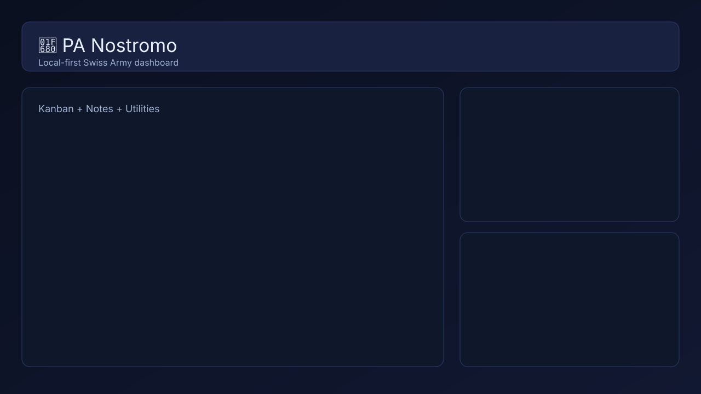

# 🚀 PA Nostromo

<p align="center">
  <b>Local-first mission control for your day-to-day work.</b><br/>
  One lightweight dashboard for projects, notes, streams, reminders, voice capture, and personal utilities.
</p>

<p align="center">
  
  
  
</p>



---

## Key Features

- **Project hub**: directory + kanban board + notes/ideas in one place
- **Personal utility pods**: reminders, timer/alarm, weather, NBA scores, crypto watchlist, RSS feed
- **Media + live inputs**: music player, camera feed pod, live stream launcher
- **Voice-to-relay workflow**: send dictated text through a local backend relay endpoint
- **Cross-browser local state sharing**: Brave/Chrome can sync through disk-backed API storage
- **State safety guardrails**: validated atomic saves, verified backups, restore endpoints, and conflict protection for simultaneous browser edits
- **Themeable cockpit**: Settings includes dark, light, system, Ember, Forest, Terminal, and Aurora themes

## Quick Start

### Requirements

- Node.js **18+**

### 1) Install

```bash
cd pa-nostromo
npm install
```

### 2) Configure local env

```bash
cp .env.example .env
```

Edit `.env` with any values you need (especially relay settings if using voice relay).

### 3) Run

```bash
npm start
```

Open: `http://127.0.0.1:4287`

See [versioning and releases](docs/versioning.md) for the app-version, release,
and state-migration policy.

## Configuration (Public-Safe)

`server.js` loads config in this order:

1. shell environment variables
2. `.env.local`
3. `.env`

### Core relay settings

- `HOST` — server bind address (default `127.0.0.1`; use `0.0.0.0` only behind trusted controls)
- `NOSTROMO_ALLOWED_HOSTS` — optional comma-separated Host allowlist for a deliberate deployment hostname; leaving it blank permits only loopback hostnames.
- `DATA_DIR` / `LOG_DIR` — runtime storage roots. Leave both blank for the private OS app-data location (`%LOCALAPPDATA%\\PA-Nostromo` on Windows); use absolute paths for a portable install.
- `STATE_API_ALLOW_REMOTE` — keep `0` unless intentionally exposing state API beyond loopback
- `NOSTROMO_API_TOKENS_JSON` — scoped bearer-token records for deliberately remote-enabled routes. A route still remains disabled until its own `*_ALLOW_REMOTE=1` flag is set.
- `NOSTROMO_API_TOKEN` — legacy state-only token compatibility; use the scoped token configuration for new setups.
- `REQUEST_BODY_LIMIT_ACTION_BYTES`, `REQUEST_BODY_LIMIT_STATE_BYTES`, `REQUEST_BODY_LIMIT_RSS_BYTES` — request size caps
- `STATE_BACKUP_MIN_INTERVAL_MS` — routine shared-state backup coalescing interval (default `30000`)
- `ROWAN_RELAY_URL` — required for `POST /api/rowan-send`
- `ROWAN_RELAY_AUTH_BEARER` — optional bearer token for upstream relay
- `ROWAN_RELAY_AUTH_HEADER` — auth header name (default `Authorization`)
- `ROWAN_RELAY_TIMEOUT_MS` — relay timeout (default `8000`)
- `ROWAN_SEND_MAX_TEXT_LENGTH` — max accepted message length (default `2000`)
- `ROWAN_ALLOW_REMOTE` — keep `0` for local-only deployments

### Private runtime storage migration

New installs keep state, backups, logs, caches, and browser-session storage outside the repository. On first start, an existing legacy `./data` or `./logs` directory is copied into the private app-data location and verified; the original folders are not removed. Existing files in the private destination are never overwritten. If the same private file already differs, startup stops so you can choose the authoritative copy (or temporarily set `DATA_DIR` / `LOG_DIR` to the legacy location) rather than silently losing data.

### Browser and remote request protection

Every response carries anti-sniffing, frame, referrer, and same-origin resource headers. Browser mutations first obtain a per-launch token from the same-origin bootstrap endpoint and send it in a custom header; cross-site Origin and `Sec-Fetch-Site: cross-site` requests are rejected. Remote API use requires both the route’s explicit remote-enable flag and a bearer token with that route’s scope. TLS must terminate at a trusted reverse proxy before any non-loopback deployment.

### Camera snapshot proxy safety

- `CAMERA_PROXY_ALLOW_REMOTE` (default `0`)
- `CAMERA_PROXY_ALLOWLIST` (required comma-separated public hosts; private, loopback, link-local, and internal-network addresses are always rejected)
- `CAMERA_PROXY_TIMEOUT_MS`
- `CAMERA_PROXY_MAX_BYTES`

### RSS fetch safety

- `RSS_FETCH_ALLOW_REMOTE` (default `0`)
- `RSS_FETCH_TIMEOUT_MS`
- `RSS_FETCH_MAX_BYTES`
- `RSS_FETCH_MAX_FEEDS`
- `RSS_FETCH_MAX_ENTRIES`
- `RSS_FETCH_CACHE_TTL_MS` (last-known-good feed cache; a failed refresh returns a visible stale result)
- `RSS_FETCH_MAX_ATTEMPTS`, `RSS_FETCH_BACKOFF_BASE_MS`, and `RSS_FETCH_BACKOFF_MAX_MS`
- `RSS_FETCH_OPERATION_TIMEOUT_MS` and `RSS_FETCH_UNHEALTHY_COOLDOWN_MS`

### Gmail Atom unread-email retry safety

When `EMAIL_UNREAD_PROVIDER=gmail_atom`, its read-only inbox snapshot supports
bounded retries through `EMAIL_UNREAD_MAX_ATTEMPTS`, the backoff variables,
`EMAIL_UNREAD_OPERATION_TIMEOUT_MS`, and
`EMAIL_UNREAD_UNHEALTHY_COOLDOWN_MS`. Authentication and parser failures are
not retried, and IMAP message actions are not affected.

### Outbound network safety

All ordinary server-side HTTP requests use a DNS-pinned request boundary. It rejects URL credentials, non-HTTP(S) schemes, loopback/private/link-local/reserved/documentation/metadata addresses, and unsafe redirect targets before connecting. Response sizes and deadlines are bounded. Expensive outbound work is globally and per-host limited, deduplicated while in flight, and cancelled during shutdown or client disconnects. See [the outbound inventory](docs/outbound-network-inventory.md) for the remaining deliberate exceptions.

### Facebook follower pod (Graph API + fallback)

Primary (recommended):

- `META_GRAPH_API_VERSION` (default `v22.0`)
- `META_GRAPH_PAGE_ID`
- `META_GRAPH_PAGE_ACCESS_TOKEN`

Fallback / optional:

- `FACEBOOK_PAGE_URL` (default `https://www.facebook.com/blastfromtheads`)
- `META_GRAPH_POLL_INTERVAL_MS` (default `60000`, min enforced to 60s)
- `META_GRAPH_TIMEOUT_MS` (default `8000`)
- `META_GRAPH_MAX_RETRIES` (default `3`)
- `META_GRAPH_BACKOFF_BASE_MS` (default `1000`)
- `META_GRAPH_BACKOFF_MAX_MS` (default `15000`)
- `META_GRAPH_OPERATION_TIMEOUT_MS` (default `20000`)
- `META_GRAPH_UNHEALTHY_COOLDOWN_MS` (default `30000`)
- `META_GRAPH_STALE_AFTER_MS` (default `180000`)
- `META_GRAPH_CRITICAL_STALE_AFTER_MS` (default `900000`)
- `META_GRAPH_ALLOW_REMOTE` (default `0`)

The backend polls every minute and persists snapshots under `DATA_DIR` with append-only poll logs under `LOG_DIR`.

If Graph credentials are missing/invalid (or Graph fetch fails), the service fetches `FACEBOOK_PAGE_URL` and tries to estimate followers from public HTML/embedded JSON signals. This is best-effort and can drift or fail when Facebook changes markup.

Optional watchdog cron (defense-in-depth):

```bash
* * * * * curl -fsS -X POST "http://127.0.0.1:4287/api/facebook-followers/refresh?source=cron" >/dev/null 2>&1
```

### Instagram follower pod (Meta Business Suite primary)

Primary mode:

- `INSTAGRAM_PROVIDER` (default `meta_suite`; options: `meta_suite`, `public`, `auto`)
- `INSTAGRAM_POLL_INTERVAL_MS` (default `180000`, min enforced to 60s)
- `INSTAGRAM_META_SUITE_URL` (default `https://business.facebook.com/latest/insights`)
- `INSTAGRAM_META_SUITE_STORAGE_PATH` (default: private `DATA_DIR/.auth/meta-suite-instagram-storage.json`)
- `INSTAGRAM_META_SUITE_TIMEOUT_MS` (default `45000`)
- `INSTAGRAM_META_SUITE_HEADFUL` (default `0`, set to `1` for debug)

Profile + optional baseline:

- `INSTAGRAM_PROFILE_HANDLE`
- `INSTAGRAM_PROFILE_NAME`
- `INSTAGRAM_PROFILE_URL`
- `INSTAGRAM_FOLLOWERS_COUNT` (optional seed fallback only)

One-time setup for authenticated Meta Suite scraping:

```bash
node scripts/instagram-meta-suite-login.mjs --storage "%LOCALAPPDATA%\\PA-Nostromo\\data\\.auth\\meta-suite-instagram-storage.json" --url "https://business.facebook.com/latest/insights"
```

Then start the server normally. The Instagram pod will poll every 3 minutes by default and keep last-known values if providers fail.

### TikTok follower pod (public scrape estimate)

- `TIKTOK_POLL_INTERVAL_MS` (default `180000`, min enforced to 60s)
- `TIKTOK_PROFILE_HANDLE` (without `@`)
- `TIKTOK_PROFILE_NAME` (optional label)
- `TIKTOK_PROFILE_URL` (e.g., `https://www.tiktok.com/@yourhandle`)
- `TIKTOK_FOLLOWERS_COUNT` (optional baseline for sanity checks only)

The backend polls TikTok every 3 minutes by default, persists snapshots under `DATA_DIR`, and appends poll events under `LOG_DIR`.

If scrape fails, the service preserves the last known non-zero value and marks the payload stale (`source: last_known_fallback`) rather than replacing with `0`.

If `TIKTOK_PROFILE_HANDLE`/`TIKTOK_PROFILE_URL` is missing, the API returns setup-required status and the pod renders setup guidance.

> Keep this app local unless you intentionally add network controls and authentication.

## Core Workflows

### 1) Dashboard state sync

- UI stores state in-memory + local fallback
- Shared persistence is exposed through:
  - `GET /api/state`
  - `POST /api/state`
- Disk-backed state lives at `DATA_DIR/state.json`
- Existing state replacements require the revision returned by the last read/write (`If-Match`); the browser handles it automatically. See [durable shared state](docs/state-persistence.md) for migration and conflict recovery.

### 2) Backup + recovery flow

- Accepted state writes are validated, serialized, and atomically renamed into place; routine snapshots are coalesced before being retained in `DATA_DIR/backups/`
- List backups: `GET /api/state/backups`
- Restore backup: `POST /api/state/restore`

### 3) RSS feed workflow

- Configure feeds in **Settings → RSS Feeds**
- Fetch pipeline via `POST /api/rss/fetch`
- Read-state and sources are persisted in shared dashboard state

### 4) Camera + stream workflows

- **Camera Feed pod** supports embed, snapshot refresh, and local webcam mode
- **Live Streams pod** supports provider presets (YouTube, Twitch, Kick, Vaughn, Rumble, X, Facebook, generic/local URL)

## Data & Storage Notes

- Main shared state file: `DATA_DIR/state.json`
- Automatic state backups: `DATA_DIR/backups/`
- Browser fallback cache: `localStorage`
- This repository is designed for **local-first usage** and personal trusted environments

## Development Scripts

Verified from `package.json`:

- `npm start` — run local server
- `npm run lint` — guardrails/static checks (`scripts/guardrails-check.js`)
- `npm run check` — syntax checks + lint
- `npm run qa:reset-state` — reset local state for QA flow
- `npm run qa:smoke:1d1`
- `npm run qa:smoke:1e1`
- `npm run qa:smoke:1e1:repeat`
- `npm run qa:smoke:1f`
- `npm run test:crypto`
- `npm run test:crypto-proxy`
- `npm run test:facebook-followers`
- `npm run qa:facebook-followers`

## Gas Provider Bake-off Harness (RapidAPI)

Quickly compare station-level gas APIs and normalize responses into a common shape.

### Setup

1. Add env vars in `.env` (or exported in shell):

```bash
RAPIDAPI_KEY=your_rapidapi_key
GAS_BAKEOFF_PROVIDERS_JSON='[
  {
    "name": "Provider 1",
    "host": "provider-one.p.rapidapi.com",
    "path": "/stations/search",
    "method": "GET",
    "query": { "zip": "{location}" }
  },
  {
    "name": "Provider 2",
    "host": "provider-two.p.rapidapi.com",
    "path": "/nearby",
    "method": "GET",
    "query": { "location": "{location}" }
  }
]'
```

2. Run (defaults to ZIP `44224` when omitted):

```bash
node scripts/gas-provider-bakeoff.mjs
node scripts/gas-provider-bakeoff.mjs --location 44224
```

### Output

The script prints:

- side-by-side scorecard per provider: coverage count, `% with price`, `% with updatedAt`
- sample stations per provider
- normalized preview with fields:
  - `name`
  - `address`
  - `distance`
  - `regular`, `mid`, `premium`, `diesel`
  - `updatedAt`

If env vars are missing/invalid, it exits gracefully with setup instructions.

## Roadmap / Status

**Status:** early alpha, actively iterated.

Near-term focus:

- Better onboarding/default templates
- Stronger multi-tab state conflict handling
- Continued pod reliability and quality-of-life improvements

Patch details are tracked in `docs/patch-notes/`.

## Contributors

- Jacob Rockwell
- Rowan

## License

MIT
